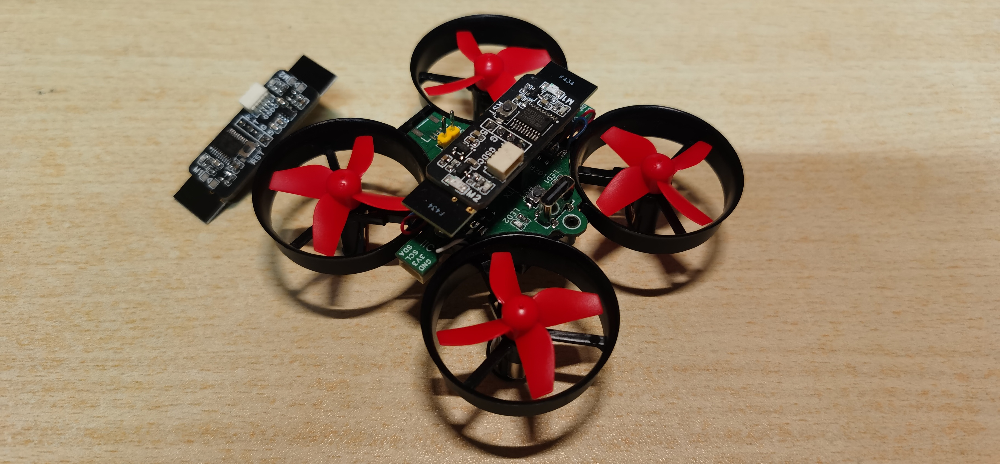
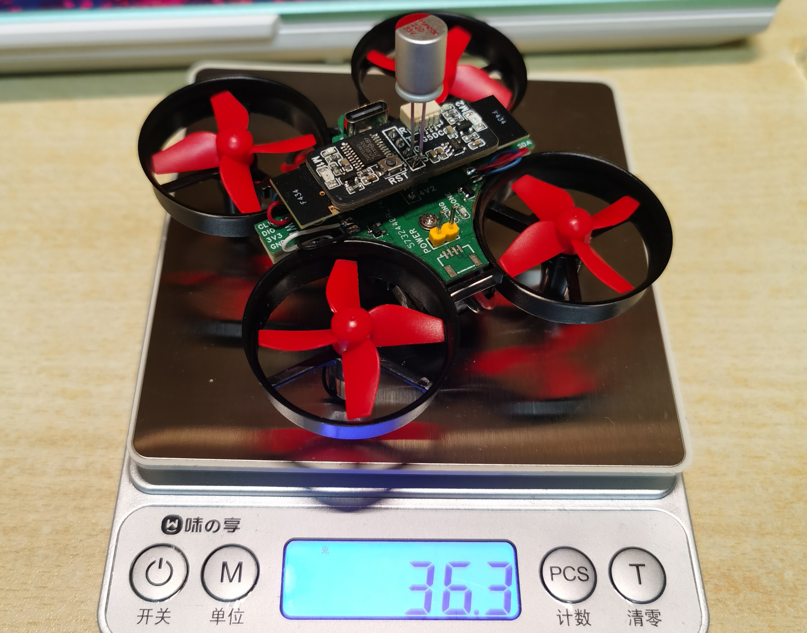
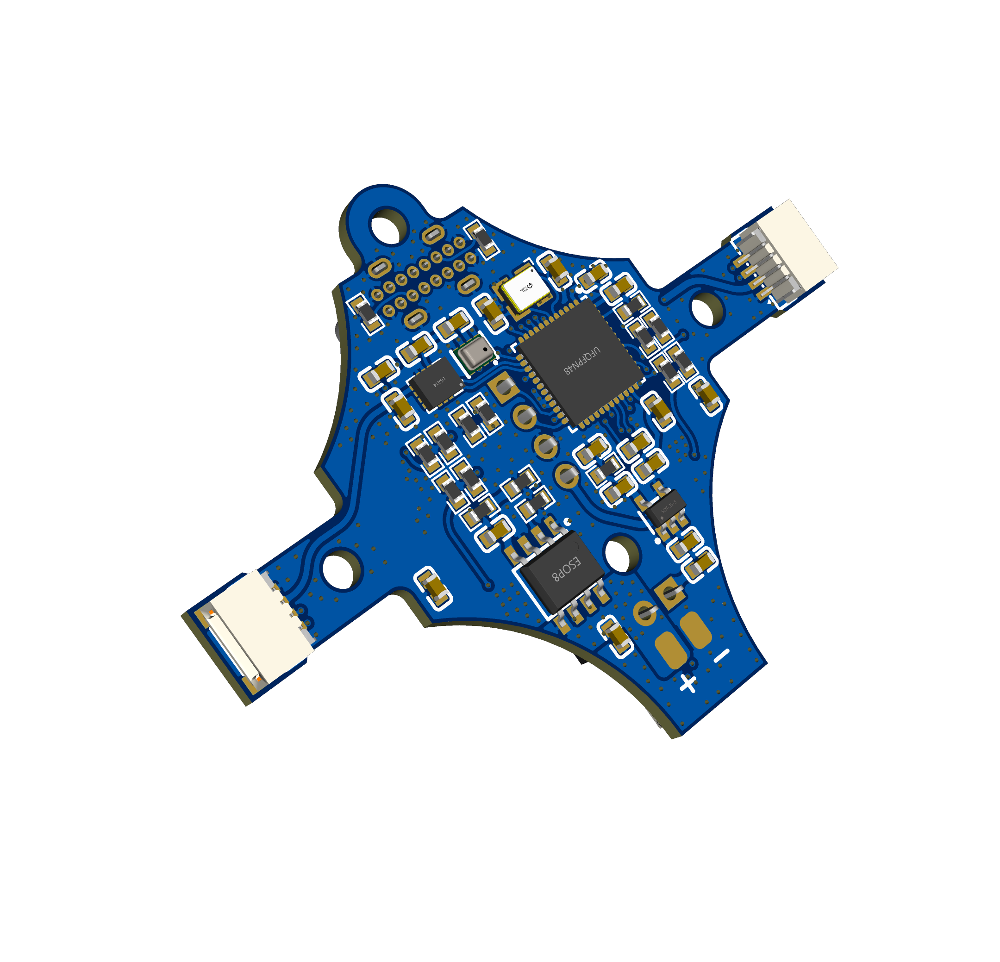

## WKMiniFlyG4 微型四旋翼算法开发平台

### Hardware

MCU: STM32G431CBU6

IMU: LSM6DS3 / LSM6DSR

BARO: BMP280 / SPL06

TP4056 锂电池充放管理

两侧引出UART1和I2C2

顶部引出UART3 用于连接WKDoubleTXG0作为双向通信模块

支持USB VCP串口

使用1S锂电池驱动，尽量使用高倍率低内阻电池，避免大幅度的压降导致通信不稳定。

在通信模块顶部添加电容可明显改善稳定性：

### Files

Hardware:  在嘉立创打样你所需的全部文件、立创EDA工程、原理图、图片等。

Python: 目前开发的双向链路通信脚本、六面椭球拟合、陀螺仪校准、Mahony姿态解算等demo，后续会不断更新。

其余为STM32CubeMX MDK工程文件。

机架购买参考链接：[JJRC H36四轴飞行器NH010风叶机架机壳电机马达电池全套配件DIY-淘宝网](https://item.taobao.com/item.htm?id=653592594706&pisk=g4Z7OS9QhQA5zOmpd4Xqh5yAwToINtSNvpMLIJKyp0n-RHez1v-E8aDBAjwOEb7hrWab9S0rwXuEAvNZi8-FE8WCAJetwDzravF4OSYzaklUgMwg14-zpkJuo5y94u7oYHioxDCN_GSZU8mnvurGT6OkDYDRYHhKe0mv_b9PWGSaE-9reOyAbu55taMkJHFKyqdxdjHKpXKdhqHZpDK-J3LvMjcxvYKKeq3xBAYJ9DFpknHKCLHKeUHvMvDZvXFK9qBjKjHKvDHYCiMVLbw5ej3AIMCVW8GXvHEjH6cTF9-tEuHWxfwSG1H_DYOi68hXvHhzPvVLh85Wj-ouH5MaaiK71Rq0GxFOAsi3iyFKdSIMT04aZl0bnNKYF0GmWAEAphhUVrytGc9d2-iSNVEr5G6_6-wL7qZVBGmS2bUEqJJ1a-Z7a8qbLpLxV0zj5uiOjQhUuRZIdkfhc5wgmSMY6M1R4itZ1b4yRKgMAxGNhtTH-Q56z-8nz1ZryxD2_t6XNm3-nxGNhtTH-4Hm3OWfhQiA.&spm=tbpc.boughtlist.suborder_itemtitle.1.481c2e8dBEFPLv&sku_properties=31309%3A3607839)

任何疑问：3161554058@qq.com

